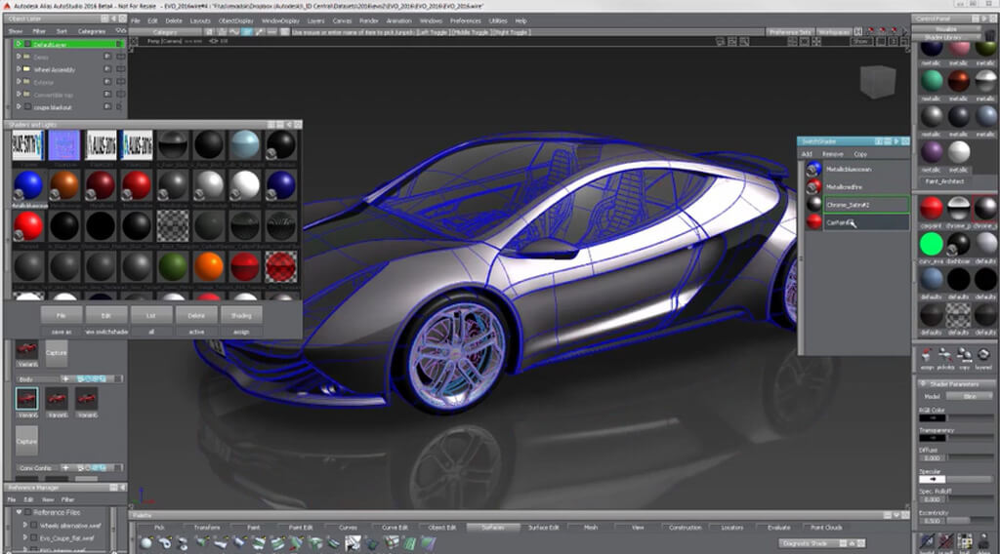
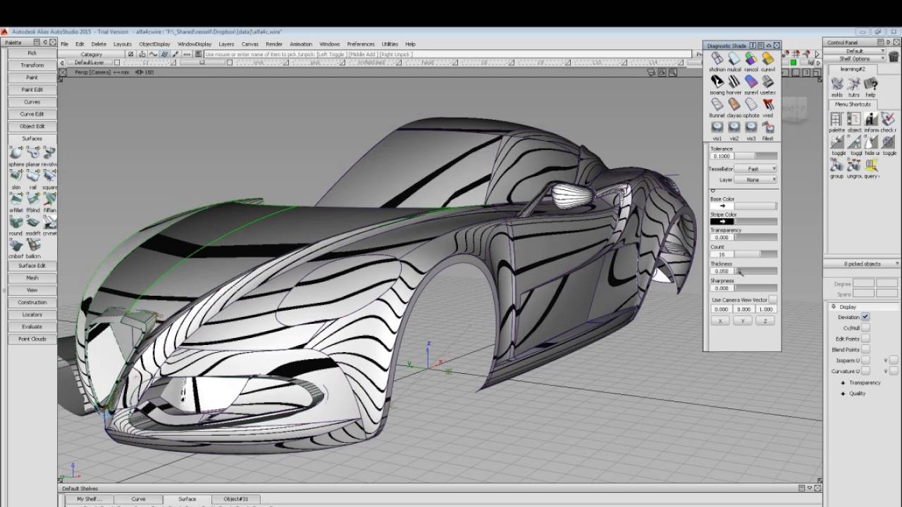
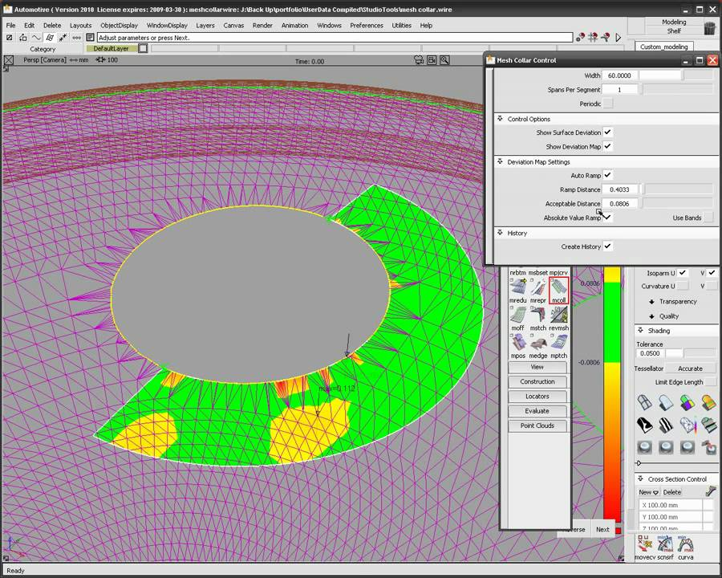
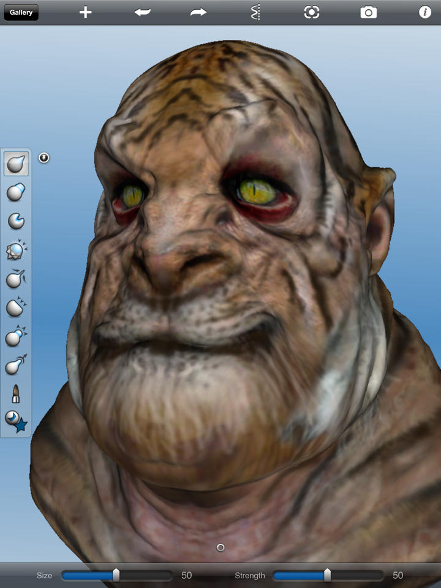
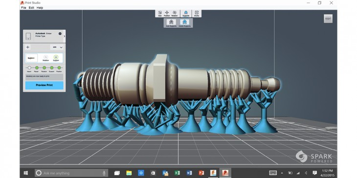
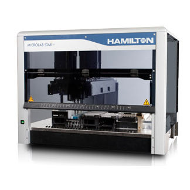

# Tasso Karkanis: Professional Portfolio

## Autodesk Alias

I worked for many years at [Autodesk](https://www.autodesk.com).  For
some of that time, I was the technical lead on the
[Alias](https://www.autodesk.com/products/alias-products/overview)
product, a software system for automotive and industrial design.

Specifically, I worked on improving the performance and scalability of
the graphics system:

and on features to work with triangular meshes created by scanning
real world objects:

## Autodesk Consumer Products

Eventually, I moved to the consumer products group and worked on
mobile apps that showcased Autodesk technology, such as 123D Sculpt,
let users build and decorate 3D models on iPad using brush stroke
interactions:

Another project was the Spark system for 3D print preparation.  The
Spark system could import 3D geometry, fix problems that would prevent
it from printing properly, add support structures for overhanging
areas, and send the results to different kinds of 3D printers.

Unfortunately, these applications are no longer available from
Autodesk.

## Deep Genomics

After leaving Autodesk, I was Director of Software Engineering at
[Deep Genomics](http://deepgenomics.com), a biotech startup that is
developing drugs to treat rare genetic diseases.  I worked on a
cloud-based microservice system to support the experimental activities
of biologists, including automation with a Hamilton liquid handler.

## Augmenta

I recently joined [Augmenta.ai](http://augmenta.ai), a new tech
startup focussing on bringing [generative
design](https://en.wikipedia.org/wiki/Generative_design) to various
industries.

